<div align="center">

# ENKI

### The Native C++20 Reactive UI Framework — One Codebase, Every Surface

*GPU-accelerated rendering · Declarative widget tree · Flexbox layout · Cubit/BLoC state management · Desktop, Embedded, Mobile & Web*


</div>

---

## Table of Contents

1. [Executive Summary](#1-executive-summary)
1a. [Showcase](#showcase)
2. [Why ENKI](#2-why-enki)
3. [Platform Support Matrix](#3-platform-support-matrix)
4. [Architecture](#4-architecture)
5. [Subsystems](#5-subsystems)
6. [Widget Catalog](#6-widget-catalog)
7. [Quick Start](#7-quick-start)
8. [State Management](#8-state-management)
9. [Internationalization](#9-internationalization)
10. [ENKI CLI](#10-enki-cli)
11. [Building from Source](#11-building-from-source)
12. [Build Options](#12-build-options)
13. [Repository Layout](#13-repository-layout)
14. [Documentation Index](#14-documentation-index)
15. [Reference Applications & Demos](#15-reference-applications--demos)
16. [Roadmap](#16-roadmap)
17. [License](#17-license)

---

## 1. Executive Summary

**ENKI** is a production-grade, native **C++20 GUI framework** designed for teams that need the productivity of a modern declarative UI toolkit without the cost of a managed runtime, a browser engine, or a platform-specific rewrite.

ENKI combines a **three-tree reactive architecture** (Widget → Element → RenderObject), a high-performance **Flexbox layout engine (Anu)**, **Skia GPU rasterization**, and a **BLoC-inspired state layer** into a single, cohesive framework. The same application code targets **Linux (X11 / Wayland / bare-metal DRM-KMS), Windows, Android, and WebAssembly**.

| | |
|---|---|
| **Language** | C++20 (designated initializers, concepts, defaulted comparisons) |
| **Rendering** | Skia (Ganesh / OpenGL ES) via native EGL / WGL contexts — no SDL, no GTK, no Qt |
| **Layout** | Anu — in-house Flexbox engine with pixel-grid snapping and layout caching |
| **State** | `Cubit<S>` / `BlocProvider` / `BlocBuilder` / `BlocListener` with granular rebuilds |
| **Build System** | Meson + Ninja, with cross-files for Android and WebAssembly |
| **License** | MIT |

---

## Showcase

Real screenshots captured from the framework's own demos and applications (see [`assets/showcase`](assets/showcase)).

<table>
  <tr>
    <td align="center" colspan="2"><b>Video Player</b> — FFmpeg + VA-API hardware decoding</td>
  </tr>
  <tr>
    <td>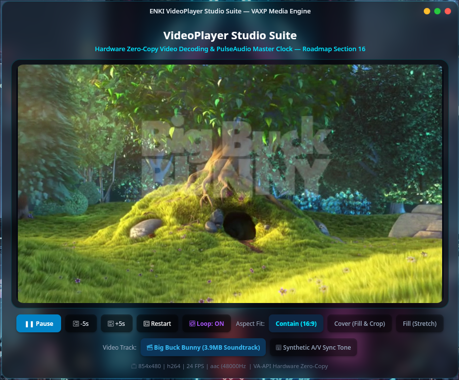</td>
    <td>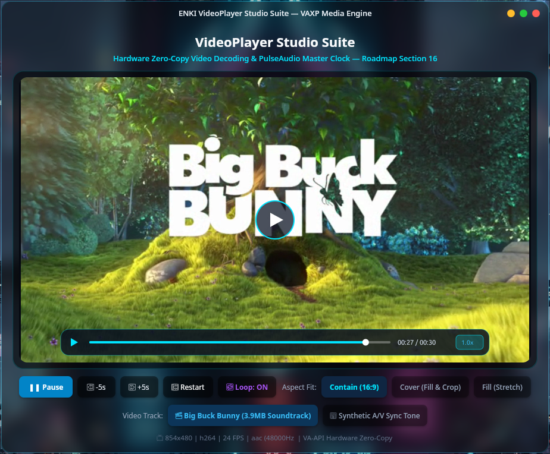</td>
  </tr>
  <tr>
    <td align="center" colspan="2"><b>Command Palette</b> — overlay &amp; theming</td>
  </tr>
  <tr>
    <td>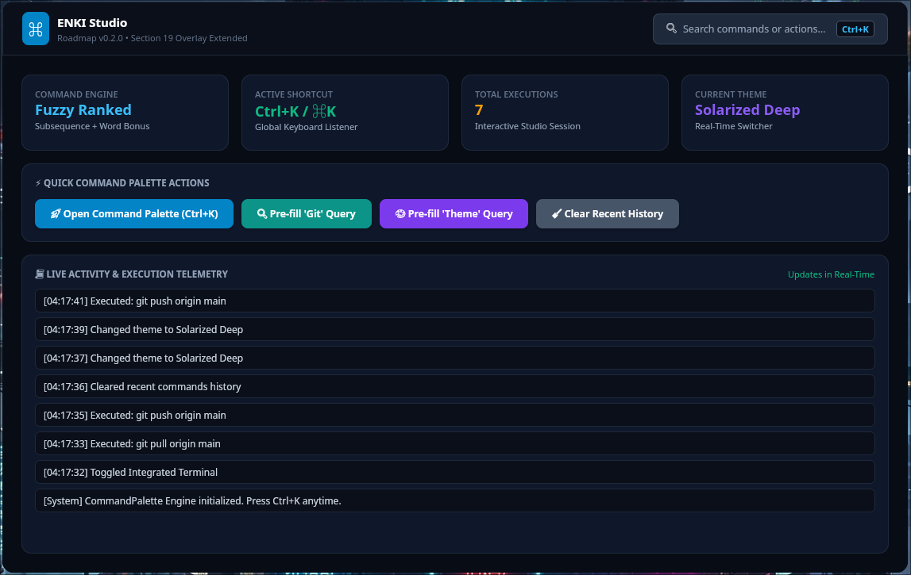</td>
    <td>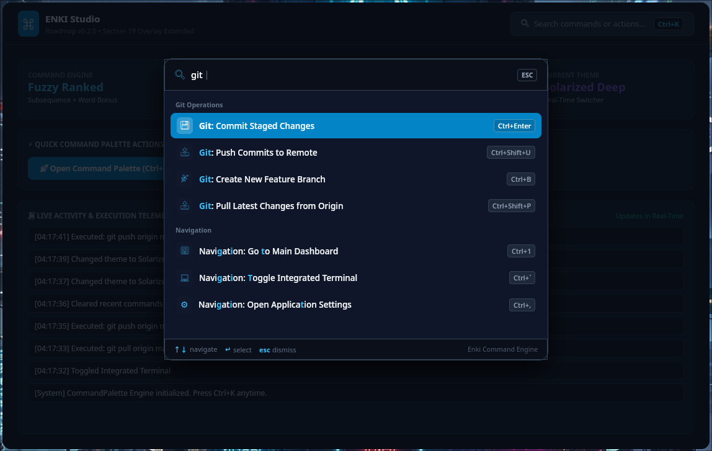</td>
  </tr>
  <tr>
    <td align="center" colspan="2"><b>Typography</b> — rich text &amp; multilingual shaping</td>
  </tr>
  <tr>
    <td>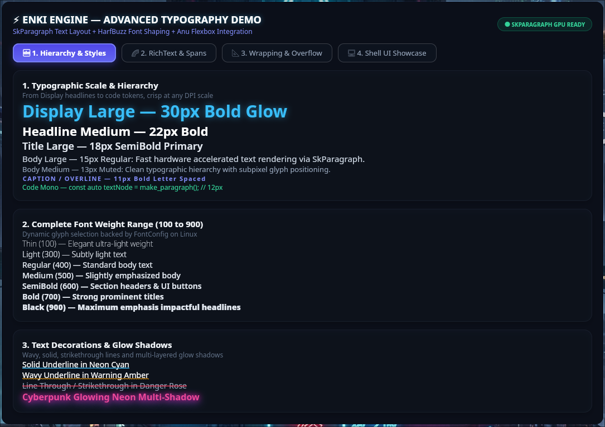</td>
    <td>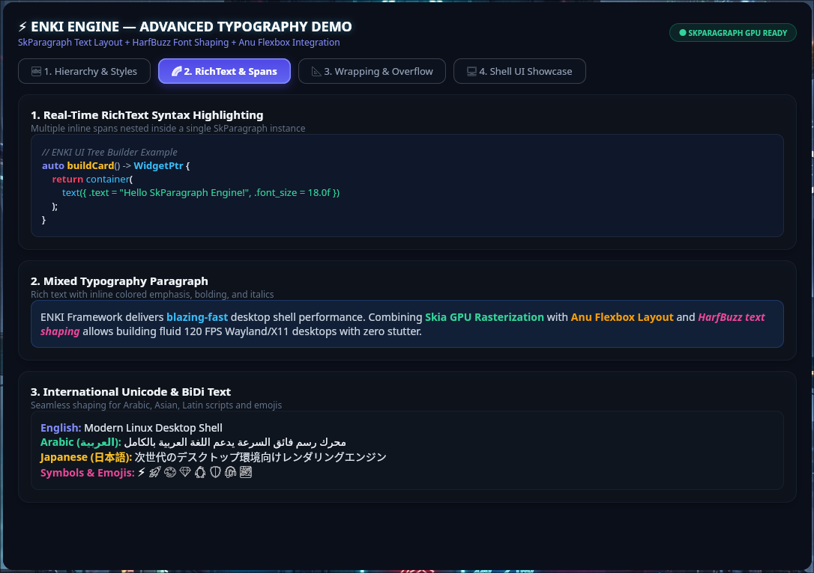</td>
  </tr>
  <tr>
    <td>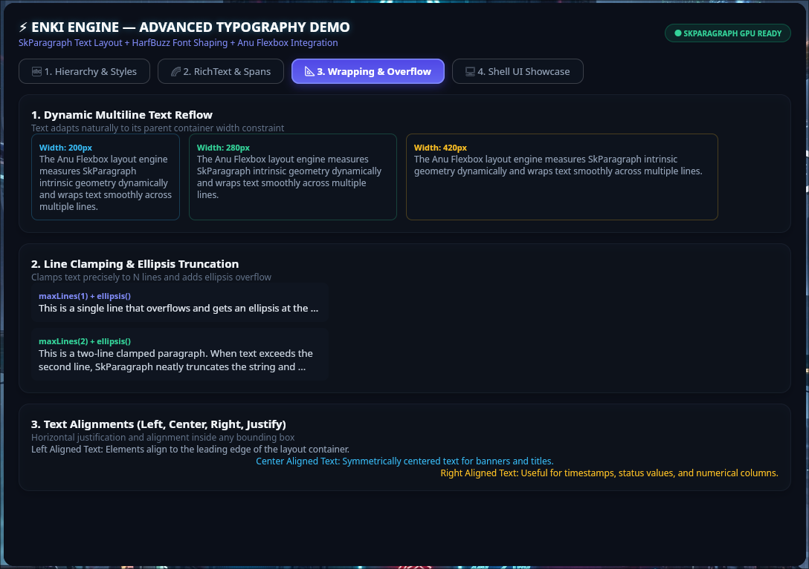</td>
    <td>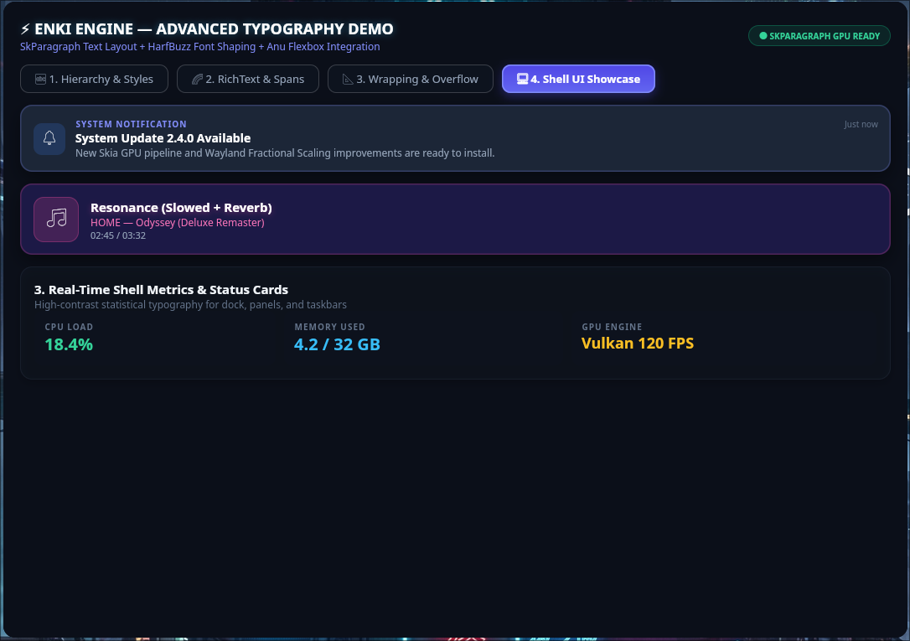</td>
  </tr>
  <tr>
    <td align="center"><b>Paint &amp; Visual Effects</b> — glass, blur, shaders</td>
    <td align="center"><b>Container</b> — gradients &amp; shaders</td>
  </tr>
  <tr>
    <td>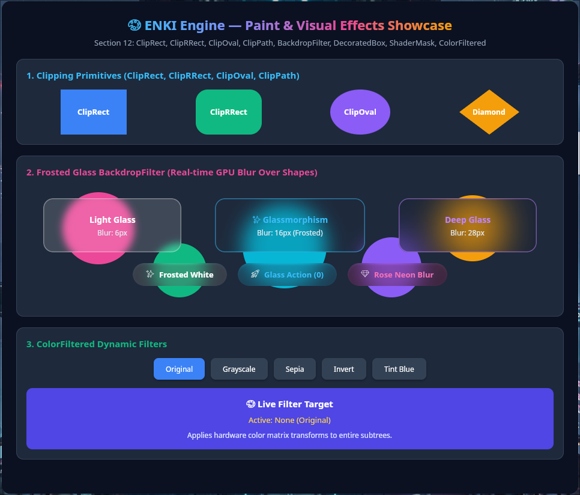</td>
    <td>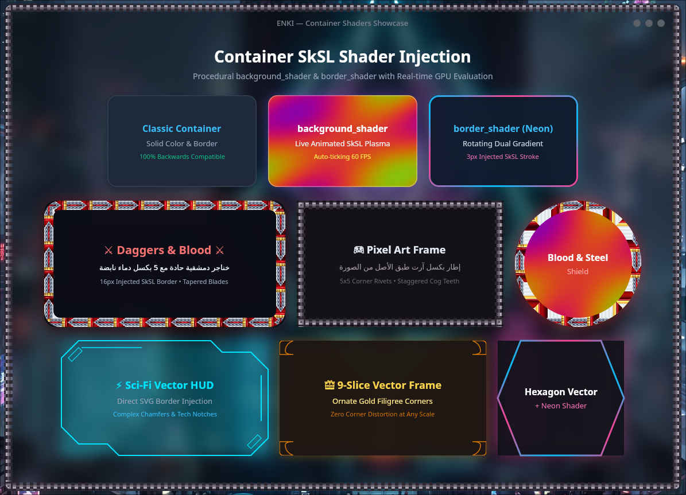</td>
  </tr>
  <tr>
    <td align="center"><b>Audio Waveform</b> — live FFT spectrum</td>
    <td align="center"><b>Image</b> — decoding &amp; fit modes</td>
  </tr>
  <tr>
    <td>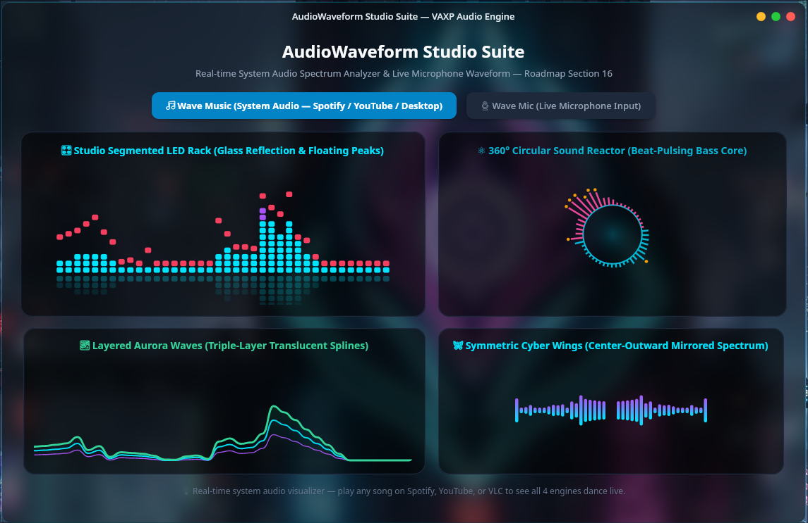</td>
    <td>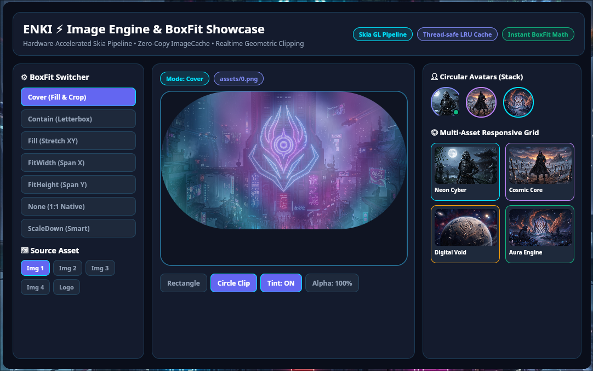</td>
  </tr>
  <tr>
    <td align="center" colspan="2"><b>Lottie</b> — vector animation</td>
  </tr>
  <tr>
    <td align="center" colspan="2">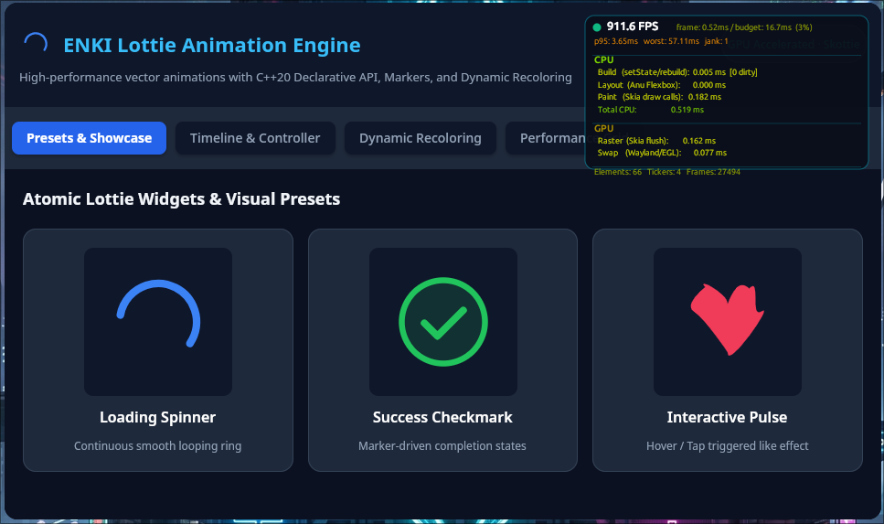</td>
  </tr>
  <tr>
    <td align="center" colspan="2"><b>One codebase, every platform</b> — the same Calculator running natively on Windows and Android, on Linux, and in the browser via WebAssembly</td>
  </tr>
  <tr>
    <td align="center" colspan="2">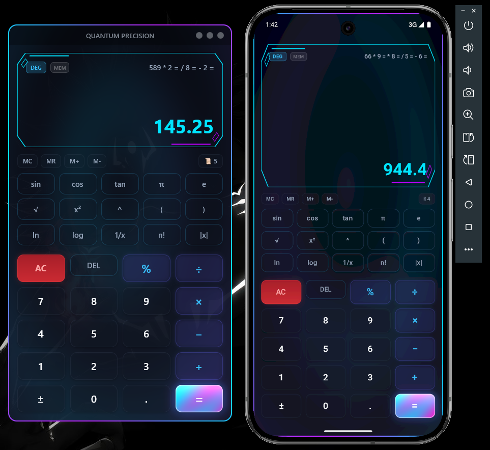<br/><sub>Windows &amp; Android</sub></td>
  </tr>
  <tr>
    <td align="center">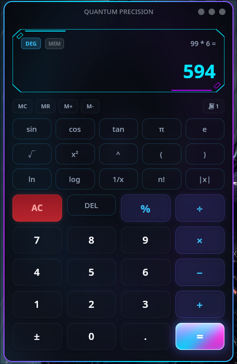<br/><sub>Linux</sub></td>
    <td align="center">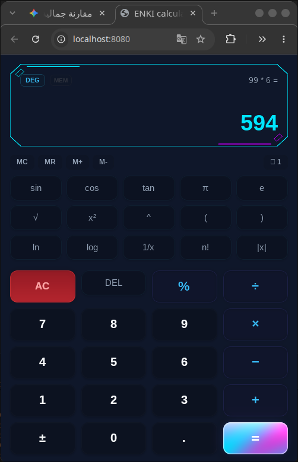<br/><sub>WebAssembly</sub></td>
  </tr>
</table>

---

## 2. Why ENKI

| Capability | What it means for your organization |
|---|---|
| **Truly native** | Compiled C++20, zero garbage collector, deterministic memory and sub-millisecond frame pacing. |
| **Zero SDL / zero toolkit lock-in** | Direct platform backends (X11, Wayland, Win32, Android NDK, DRM/KMS) — a minimal, auditable dependency surface. |
| **Declarative & reactive** | Widget composition with `StatelessWidget`, `StatefulWidget`, keys and an incremental reconciler. |
| **Granular rebuilds** | Only the `BlocBuilder` subtree is rebuilt on state change — pages remain stateless and are built once. |
| **One codebase, five targets** | Desktop, embedded kiosks, Android, and the web share the same widget code. |
| **Desktop-shell capable** | Layer-shell, foreign-toplevel management, native popups, client-side decorations — build panels, docks and entire shells. |
| **Rich media built in** | Lottie, SVG, FFmpeg/VA-API video, live audio spectrum, particle systems and path morphing. |
| **Web-technology bridge** | Optional Chromium (CEF) host exposing a permission-gated `window.enki.*` API — an Electron-class runtime on ENKI's native stack. |
| **First-class i18n & RTL** | Unicode CLDR plural rules (including 6-form Arabic), OS locale detection and live language switching. |
| **Developer tooling** | A dedicated `enki` CLI for diagnostics, scaffolding, device discovery, run and packaging. |
| **Testable** | Cubits and widget trees run headless — no display server, GL context or Skia needed for unit tests. |

---

## 3. Platform Support Matrix

| Platform | Windowing / Surface | Graphics | Status |
|---|---|---|---|
| **Linux — X11** | Native Xlib (+ XRandR) | EGL / OpenGL + Skia | ✅ Supported |
| **Linux — Wayland** | `xdg-shell`, `xdg-decoration`, `xdg-output`, `wlr-layer-shell`, `wlr-foreign-toplevel-management` | wayland-egl + Skia | ✅ Supported |
| **Linux — Embedded (DRM/KMS)** | DRM + GBM + libinput + libudev, direct scanout | EGL / GLES | ✅ Optional (`-Denable_drm=true`) |
| **Windows** | Win32 + DWM + UxTheme | OpenGL + Skia | ✅ Supported (MSVC / MSYS2) |
| **Android** | NDK native activity, app glue | EGL + GLESv3 | ✅ arm64, APK packaging scripts included |
| **WebAssembly** | Emscripten | WebGL | 🧪 Cross-file provided (`cross/wasm.ini`) |

Compiler baseline: **GCC 13+ / Clang 16+ / MSVC 2022**, C++20, Meson ≥ 1.1.

---

## 4. Architecture

```
┌──────────────────────────────────────────────────────────────────────────┐
│                           Your Application (C++20)                       │
│        StatelessWidget · StatefulWidget · Cubit · I18n · Navigator       │
├──────────────────────────────────────────────────────────────────────────┤
│  State Layer          │  Widget Layer (130+ widgets)  │  Animation Layer │
│  Cubit / Bloc /       │  Layout · Input · Navigation  │  Controllers,    │
│  Stream / Provider    │  Overlays · Data · Media      │  Springs, Curves │
├──────────────────────────────────────────────────────────────────────────┤
│                 Three-Tree Core:  Widget → Element → RenderObject        │
│                 Reconciler · Keys · BuildContext · Gesture Recognizers   │
├───────────────────────────────┬──────────────────────────────────────────┤
│  Anu Layout Engine (Flexbox)  │  Rendering (Canvas · Paint · Path · SVG) │
├───────────────────────────────┴──────────────────────────────────────────┤
│                  Skia GPU Backend (Ganesh · SkParagraph · Skottie)       │
├──────────────────────────────────────────────────────────────────────────┤
│  Platform Abstraction: X11 │ Wayland │ DRM/KMS │ Win32 │ Android │ WASM  │
└──────────────────────────────────────────────────────────────────────────┘
        Optional modules:  Audio (FFT) · Video (FFmpeg) · WebView (CEF)
```

**Design principles**

- **Separation of concerns** — business logic lives in Cubits; the UI is strictly declarative.
- **Deterministic lifetimes** — subscriptions are bound to the Element tree and cancelled automatically on unmount.
- **Compile-time safety** — designated-initializer props (`text("Hi", { .font_size = 20 })`) and defaulted state equality.
- **Pluggable platform layer** — each backend is compiled only when its dependencies are present.

---

## 5. Subsystems

### 5.1 Core Engine
- **Widget tree** — `Widget`, `Element`, `RenderObject`, `Reconciler`, `Key`, `BuildContext`.
- **Gesture system** — tap, long-press, drag, hover, mouse regions, dismissible, drag-and-drop.
- **Memory & string utilities** — arena-friendly memory core and Unicode-aware string helpers.

### 5.2 Anu Layout Engine
A self-contained Flexbox implementation (`core/layout_engine`) with:
- Full flex algorithm: lines, wrap, grow/shrink, baseline alignment.
- Absolute positioning, pixel-grid snapping, layout cache for incremental relayout.
- Intrinsic sizing, overflow and limited boxes, custom multi-child layouts, `Flow`.

### 5.3 Rendering
- `Canvas`, `Paint`, `Path`, `Color`, `Image`, `SVG`, `FontManager` abstractions over **Skia**.
- Paint effects: backdrop blur (glassmorphism), shader masks, color filters, clip rect/rrect/oval/path, decorated boxes.
- `SkiaCanvas` widget for direct custom drawing.
- Lottie vector animations via Skottie.

### 5.4 State Management
- `Cubit<S>`, `Bloc`, `Stream`, `BlocProvider`, `BlocBuilder`, `BlocListener`, global `BlocObserver`.
- See [Cubit guide](docs/state_management/cubit.md).

### 5.5 Animation & Motion
- `AnimationController`, `Tween`, `Curves`, **spring physics** (`SpringSimulation` / `SpringController`).
- Timelines with stagger, **SVG path morphing**, **particle systems**, Lottie controller.
- Implicit animations: `AnimatedContainer`, `AnimatedOpacity`, `AnimatedScale`, `AnimatedRotation`, `AnimatedSlide`, `AnimatedSwitcher`, `Hero` transitions.

### 5.6 Internationalization & Localization
- Declarative dictionaries (`I18nConfig`), `tr()`, `trPlural()`, `localizedText()`.
- Unicode CLDR plurals (zero / one / two / few / many / other), BCP-47 parsing, RTL detection, native OS locale discovery, reactive `onLocaleChanged()` signal.
- See [Localization guide](docs/i18n/localization.md).

### 5.7 Desktop Shell Subsystem
- `ShellApp`, `SurfaceHost`, `NativePopup` — build **panels, docks, overlays, launchers and window managers' shells** on Wayland layer-shell.
- Foreign-toplevel management (taskbars/docks), output monitoring, clipboard & drag-and-drop.
- Client-side decorations: `WindowFrame` and `TitleBar` with a resize engine.

### 5.8 Audio Subsystem (`modules/audio`)
PulseAudio / Windows capture, FFT DSP analyzer and an `AudioWaveform` widget for live spectrum visualization.

### 5.9 Video Subsystem (`modules/video`)
FFmpeg decoding with **VA-API hardware acceleration**, PulseAudio master clock for A/V sync, and a `VideoPlayer` widget.

### 5.10 Web Technology Host (`modules/web_technology`)
- Optional **Chromium (CEF)** runtime — HTML/CSS/JS apps with native access via `window.enki.*`.
- Permission-gated native APIs, app manifest (`enki.json`), starter template and web packager.
- Enable with `-Denable_webview=true`. See [Web Technology docs](docs/web_technology/README.md).

### 5.11 Mobile (Android)
NDK cross-compilation (`cross/android-arm64.ini`), native glue, EGL/GLES surface, runtime permissions and APK packaging scripts (`scripts/package_*_apk.py`). See [docs/android.md](docs/android.md).

---

## 6. Widget Catalog

ENKI ships well over **130 production widgets**, each documented in [`docs/enki`](docs/enki) and demonstrated in [`widgets_demo`](widgets_demo).

| Category | Widgets |
|---|---|
| **Layout** | Row, Column, Stack, Container, SizedBox, Expanded, Flexible, Padding, Align, Center, Positioned, Wrap, Spacer, AspectRatio, ConstrainedBox, FractionallySizedBox, IntrinsicWidth/Height, OverflowBox, LimitedBox, Flow, CustomMultiChildLayout |
| **Basic UI** | Text, RichText, Icon, Image, Avatar, Badge, Divider, Card, Chip, Button, IconButton, FloatingActionButton, Placeholder |
| **Input & Forms** | TextField, TextArea, PasswordField, NumberField, SearchField, ComboBox, Checkbox, Radio, Switch, Slider, RangeSlider, DatePicker, TimePicker, ColorPicker, Form / FormField |
| **Rich Input Controls** | ToggleButton, SegmentedControl, RatingBar, Knob, OTPField, PinField, TagInput, FileDropZone |
| **Scrolling & Lists** | ScrollView, ListView, GridView, Slivers (List/Grid/AppBar), CustomScrollView, Scrollbar, ListTile, GridTile, ReorderableList, TreeView, Table, DataTable |
| **Advanced Data UI** | **DataGrid**, Timeline, Accordion, ExpansionPanel, SplitView, ResizablePanel, Carousel, Calendar |
| **Navigation** | Navigator, Route/Page, TabBar/TabView, NavigationBar, NavigationRail, Sidebar, Drawer, Breadcrumb, Hero |
| **Overlays** | Dialog, BottomSheet, Snackbar, DropdownMenu, FloatingPanel, **CommandPalette**, **Spotlight** |
| **Native Popups** | ContextMenu, Menu, Popover, Popup, Tooltip, FilePicker |
| **Feedback** | ProgressBar, ProgressRing, Spinner, Skeleton, Pulse, Ripple, CountBadge, Notification, LoadingOverlay |
| **Gestures & Interaction** | GestureDetector, Draggable, DragTarget, Dismissible, LongPress, HoverRegion, MouseRegion, Focus |
| **Paint & Visual Effects** | BackdropFilter, ShaderMask, ColorFiltered, DecoratedBox, ClipRect/RRect/Oval/Path |
| **Typography** | SelectableText, CodeBlock, Marquee, RichText |
| **Motion** | Animated* family, Hero, SVG Morph, Spring Physics, Particle System, Timeline & Stagger |
| **Advanced / Media** | Lottie, SkiaCanvas, VideoPlayer, AudioWaveform |
| **Utility** | Visibility, IgnorePointer |
| **Desktop Shell** | TitleBar, WindowFrame, ShellApp, SurfaceHost |

---

## 7. Quick Start

### Hello, ENKI

```cpp
#include "enki/app/app.hpp"
#include "enki/widgets/text.hpp"

using namespace enki;

class HelloApp : public StatelessWidget {
public:
    WidgetPtr build(BuildContext&) override {
        return text("Hello, ENKI Framework!", {
            .color     = 0xFFFFFFFF,
            .font_size = 20.0f,
        });
    }
    std::string_view typeName() const override { return "HelloApp"; }
};

int main() {
    AppConfig config;
    config.title      = "My ENKI Application";
    config.width      = 1280;
    config.height     = 800;
    config.resizable  = true;
    config.enable_csd = true;
    config.app_id     = "org.enki.myapp";

    return runApp(std::make_shared<HelloApp>(), config);
}
```

Prefer scaffolding? Use the CLI: `enki create my_app`.

---

## 8. State Management

ENKI's Cubit system keeps pages static and rebuilds **only** what changed.

```cpp
struct CounterState {
    int value = 0;
    bool operator==(const CounterState&) const = default;
};

class CounterCubit : public enki::Cubit<CounterState> {
public:
    CounterCubit() : Cubit(CounterState{0}) {}
    void increment() { emit(CounterState{state().value + 1}); }
    void decrement() { emit(CounterState{state().value - 1}); }
    void reset()     { emit(CounterState{0}); }
};
```

```
[CounterApp]  →  [BlocProvider<CounterCubit>]  →  [CounterPage]  (built once)
                                                      └── [BlocBuilder<CounterCubit>]
                                                              ⚡ only this subtree rebuilds
```

Components: `BlocProvider` (dependency injection via `BuildContext`), `BlocBuilder` (granular rebuild with optional `buildWhen`), `BlocListener` (side effects such as dialogs/navigation), `BlocObserver` (global telemetry). Full guide: [docs/state_management/cubit.md](docs/state_management/cubit.md). Working sample: [`real_app/counter`](real_app/counter).

---

## 9. Internationalization

- Arabic, Latin, CJK and other scripts with BiDi-aware text rendering (`SkParagraph` / HarfBuzz / ICU).
- Thread-safe `I18n` manager with locale fallback cascade.
- `trPlural("items", n)` selects the grammatically correct form for **any CLDR language**.
- `I18n::setLocale()` updates the live UI instantly.

Guide: [docs/i18n/localization.md](docs/i18n/localization.md) · Reference app: [`real_app/gallery`](real_app/gallery).

---

## 10. ENKI CLI

A standalone toolchain (`tools/cli`) for the full application lifecycle.

| Command | Purpose |
|---|---|
| `enki doctor` | Diagnose compilers, SDKs (Linux, MSVC, Android NDK, WASM) and available backends. |
| `enki devices` | List Desktop, DRM and Android targets. |
| `enki create <name>` | Scaffold a new application with a clean architecture. |
| `enki run <app> <target>` | Build and run on `desktop`, `drm`, or `android` (build, package, sign, deploy). |
| `enki clean` | Remove build artifacts. |

```sh
enki doctor
enki create my_app
enki run gallery desktop      # Linux / Windows desktop
enki run gallery drm          # Bare-metal DRM/KMS direct scanout
enki run gallery android      # Build, package, sign and deploy to a device
```

Install the CLI:

```sh
cd tools/cli
meson setup build --prefix=/usr --buildtype=release
meson compile -C build
sudo meson install -C build
```

Or run directly from the repository root via the launcher: `./enki -h` (Linux/macOS) or `enki.bat` (Windows).

---

## 11. Building from Source

### Prerequisites

| Component | Requirement |
|---|---|
| Compiler | GCC 13+ / Clang 16+ / MSVC 2022 (C++20) |
| Build | Meson ≥ 1.1, Ninja |
| Graphics | Skia (prebuilt in `core/skia`, or system), EGL, OpenGL |
| Linux | X11; optional Wayland (client, egl, cursor, xkbcommon, `wayland-scanner`), fontconfig, zlib |
| Media | FFmpeg (`libavcodec`, `libavformat`, `libavutil`, `libswscale`, `libswresample`), optional VA-API, PulseAudio |
| Embedded | Optional libdrm, gbm, libinput, libudev |

### Linux / macOS-style desktop build

```sh
meson setup build --prefix=/usr --buildtype=release
meson compile -C build
meson install -C build
```

With the WebView subsystem:

```sh
meson setup build --prefix=/usr --buildtype=release -Denable_webview=true
```

With the embedded DRM/KMS backend:

```sh
meson setup build --buildtype=release -Denable_drm=true
```

### Windows (MSVC + MSYS2 toolchain)

```bat
cmd.exe /c "call ""C:\Program Files (x86)\Microsoft Visual Studio\2022\BuildTools\VC\Auxiliary\Build\vcvars64.bat"" && C:\msys64\ucrt64\bin\meson.exe setup build-Win --backend ninja -Dbuildtype=release -Db_vscrt=mt"
cmd.exe /c "call ""C:\Program Files (x86)\Microsoft Visual Studio\2022\BuildTools\VC\Auxiliary\Build\vcvars64.bat"" && ninja -C build-Win"
```

### Android (arm64)

Prerequisites, Skia-for-Android build and cross-file setup are covered in [docs/android.md](docs/android.md). Build and package (PowerShell):

```powershell
$env:PATH = "C:\msys64\ucrt64\bin;" + $env:PATH; ninja -C build-android
$env:PATH = "C:\msys64\ucrt64\bin;" + $env:PATH; python3 scripts/package_android_apk.py
$env:PATH = "C:\msys64\ucrt64\bin;" + $env:PATH; python3 scripts/package_calculator_apk.py
$env:PATH = "C:\msys64\ucrt64\bin;" + $env:PATH; python3 scripts/package_gallery_apk.py
```

### WebAssembly

Use the Emscripten cross-file at [`cross/wasm.ini`](cross/wasm.ini) with `meson setup build-wasm --cross-file cross/wasm.ini`.

---

## 12. Build Options

Defined in [`meson_options.txt`](meson_options.txt):

| Option | Default | Description |
|---|---|---|
| `build_tests` | `true` | Build unit tests |
| `build_examples` | `false` | Build example applications (desktop shell, dock, CSD, clipboard/DnD, web host…) |
| `build_widgets_demo` | `true` | Build the per-widget demo applications |
| `enable_webview` | `false` | Enable the CEF-based WebView widget / Web Host |
| `cef_root` | `""` | Absolute path to the CEF prebuilt distribution |
| `enable_drm` | `false` | Enable Linux DRM/KMS + GBM embedded backend |

Optional subsystems (**audio**, **video**) are auto-enabled when their dependencies are detected.

---

## 13. Repository Layout

```
enki/
├── include/enki/      Public C++ headers (app, tree, widgets, state, animation, i18n, rendering, platform, shell)
├── src/               Framework implementation
│   ├── app/ tree/ state/ gestures/ animation/ i18n/ rendering/ core/
│   ├── widgets/       130+ widget implementations
│   ├── shell/         Desktop-shell subsystem
│   └── platform/      x11 · wayland · drm · windows · android · wasm
├── core/              Anu layout engine · Skia (Linux/Android/WASM) · Skia-Windows · FFmpeg (Windows)
├── modules/           audio · video · web_technology (CEF)
├── protocols/         Wayland protocol XML (xdg-shell, layer-shell, foreign-toplevel, xdg-output, xdg-decoration)
├── tools/cli/         The `enki` command-line toolchain
├── real_app/          Production-style apps: counter · calculator · gallery
├── widgets_demo/      One runnable demo per widget
├── examples/          Desktop shell, dock, CSD, clipboard/DnD, web host demos
├── tests/             Tree, widget, rendering and platform tests
├── cross/             Meson cross-files (android-arm64, wasm)
├── scripts/           Android APK packaging
└── docs/              Complete documentation
```

---

## 14. Documentation Index

| Area | Location |
|---|---|
| **Application startup & `AppConfig`** | [docs/enki/Start Application](docs/enki/Start%20Application/start_application.md) |
| **Layout** | [docs/enki/Layout](docs/enki/Layout/README.md) |
| **Basic UI** | [docs/enki/Basic UI](docs/enki/Basic%20UI/README.md) |
| **Input & Forms** | [docs/enki/Input Forms](docs/enki/Input%20Forms/README.md) |
| **Rich Input Controls** | [docs/enki/Rich Input Controls](docs/enki/Rich%20Input%20Controls/README.md) |
| **Scrolling & Lists** | [docs/enki/Scrolling-Lists](docs/enki/Scrolling-Lists/README.md) |
| **Advanced Data UI** | [docs/enki/Advanced  Data UI](docs/enki/Advanced%20%20Data%20UI/README.md) |
| **Navigation** | [docs/enki/Navigation](docs/enki/Navigation/README.md) |
| **Overlays** | [docs/enki/Overlays](docs/enki/Overlays/README.md) |
| **Native Popups** | [docs/enki/NativePopups](docs/enki/NativePopups/README.md) |
| **Feedback** | [docs/enki/Feedback](docs/enki/Feedback/README.md) |
| **Gestures & Interaction** | [docs/enki/Gestures-Interaction](docs/enki/Gestures-Interaction/README.md) |
| **Animation & Motion** | [docs/enki/Animation & Motion](docs/enki/Animation%20%26%20Motion/README.md) |
| **Paint & Visual Effects** | [docs/enki/Paint & Visual Effects](docs/enki/Paint%20%26%20Visual%20Effects/README.md) |
| **Typography** | [docs/enki/Typography](docs/enki/Typography/README.md) |
| **Utility / Behavioral** | [docs/enki/UtilityBehavioral](docs/enki/UtilityBehavioral/README.md) |
| **Advanced Widgets (Lottie, Skia, Video, Audio)** | [docs/enki/Advancedwidgets](docs/enki/Advancedwidgets/README.md) |
| **State Management (Cubit)** | [docs/state_management/cubit.md](docs/state_management/cubit.md) |
| **Internationalization** | [docs/i18n/localization.md](docs/i18n/localization.md) |
| **Web Technology Host** | [docs/web_technology](docs/web_technology/README.md) |
| **Android** | [docs/android.md](docs/android.md) |
| **Browser architecture comparison** | [BROWSER_ARCHITECTURE_COMPARISON.md](BROWSER_ARCHITECTURE_COMPARISON.md) |

---

## 15. Reference Applications & Demos

- **[`real_app/counter`](real_app/counter)** — Cubit/BlocBuilder with a live element-tree rebuild diagnostic.
- **[`real_app/calculator`](real_app/calculator)** — Desktop and Android calculator.
- **[`real_app/gallery`](real_app/gallery)** — Showcase application with localization and Android packaging.
- **[`widgets_demo`](widgets_demo)** — 100+ standalone demos, from `button_demo` and `data_grid_demo` to `lottie_demo`, `video_player_demo`, `command_palette_demo` and `benchmark_demo`.
- **[`examples`](examples)** — `desktop_shell_demo`, `toplevel_dock_demo`, `outputs_monitor_demo`, `overlay_logo_demo`, `csd_window_demo`, `clipboard_dnd_demo`, `web_host_demo`.

---

## 16. Roadmap

| Release | Theme |
|---|---|
| **v0.1.0 (current)** | Three-tree reactive core, Anu layout, Skia rendering, 130+ widgets, Cubit state, i18n, multi-platform backends, CLI. |
| **v0.2.0** | Widget expansion — extended layout, rich input controls, data UI — see [WIDGETS_ROADMAP_v0.2.0.md](WIDGETS_ROADMAP_v0.2.0.md). |
| **v0.3.0** | **Sovereign Transition: Skia → Nisaba.** Replace Skia with the in-house Nisaba 2D engine (GPU, text/BiDi, effects, Lottie, SVG, image codecs) with zero external binary dependencies and no public widget-API changes — see [ROADMAP_v0.3.0.md](ROADMAP_v0.3.0.md). |

Widget coverage tracking: [WIDGETS_ROADMAP.md](WIDGETS_ROADMAP.md).

---

## 17. License

ENKI is released under the **MIT License**.

<div align="center">

**ENKI — Build once. Render natively. Run everywhere.**

</div>
