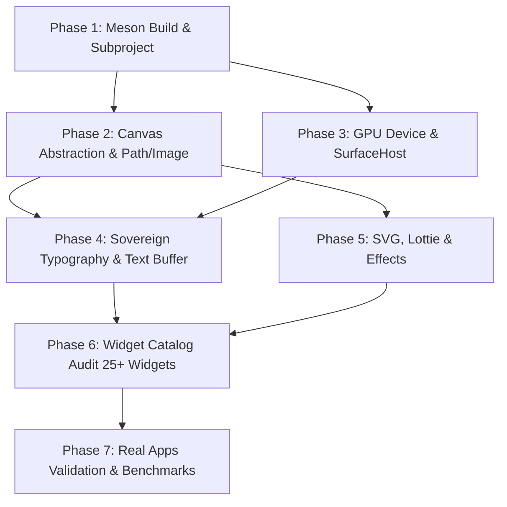

# ENKI Engine — Roadmap v0.3.0
## The Sovereign Transition: Skia ➔ Nisaba Engine Migration

> **Target Release**: `v0.3.0`  
> **Core Objective**: Replace Skia with the in-house sovereign **Nisaba** 2D graphics & layout engine (`vaxp/nisaba`).  
> **Strategic Goal**: Complete technological sovereignty, zero external binary dependencies, dramatic binary size reduction, and unified C++20 architecture across Linux, Windows, Android, WASM, and Embedded DRM/KMS.

---

## Executive Summary

ENKI v0.1.0 and v0.2.0 successfully established its native Three-Tree reactive UI architecture (Widget ➔ Element ➔ RenderObject) and Anu layout engine. However, the graphics pipeline was coupled to legacy Skia prebuilts (`libskia.a`, `libskparagraph.a`, `libskottie.a`, `icudtl.dat`, `harfbuzz`, `freetype`).

With the development of **Nisaba** (`/home/x/Desktop/nisaba`) within the **`vaxp`** organization, ENKI now has a sovereign, zero-dependency, C++20 native 2D graphics engine providing 1:1 parity with Skia's capabilities:
- Native Multilingual Typography & OpenType/BiDi engine (`nisaba::text`)
- Multi-backend GPU acceleration (OpenGL ES 3.2 / Desktop GL & Vulkan via `nisaba::gpu`)
- Built-in Glassmorphism, SDF Shadows, and Blur (`nisaba::effects`)
- Sovereign Lottie Vector Animation (`nisaba::lottie`)
- Sovereign SVG Parsing, SIMD Caching & Rendering (`nisaba::svg`)
- Sovereign Image Codecs (PNG, JPEG, QOI via `nisaba::image`)
- Geometric Path Booleans and Stroker (`nisaba::path_ops`, `nisaba::stroker`)

v0.3.0 is entirely focused on executing this migration smoothly without disrupting ENKI's public reactive widget API.

---

## Subsystem Architecture Mapping (Skia ➔ Nisaba)

| Subsystem | Skia (Current v0.2.0) | Nisaba Engine (Target v0.3.0) | Status |
| :--- | :--- | :--- | :---: |
| **GPU Context** | `GrDirectContext` (Ganesh GL) | `nisaba::gpu::GpuDevice` + `Context` | 📋 Planned |
| **GPU Surface / Target** | `SkSurface::MakeFromBackendRenderTarget` | `nisaba::gpu::GpuSurface::from_screen(dev, w, h, fbo)` | 📋 Planned |
| **Hardware 2D Canvas** | `SkCanvas` | `nisaba::gpu::GpuCanvas` & `nisaba::ICanvas` | 📋 Planned |
| **Typography & Shaping** | `skia::textlayout::Paragraph` / HarfBuzz | `nisaba::text::Buffer` + `FontSystem` + `BiDi` | 📋 Planned |
| **Vector Paths & Curves** | `SkPath`, `SkPathMeasure` | `nisaba::Path`, `nisaba::Stroker`, `path_ops` | 📋 Planned |
| **Visual Effects & Glass** | `SkImageFilters::Blur`, `SkMaskFilter` | `nisaba::effects::GlassParams`, `DropShadow` | 📋 Planned |
| **Lottie Player** | `skia/modules/skottie` | `nisaba::lottie::Player` / `Animation` | 📋 Planned |
| **Vector SVG Engine** | `SkParsePath`, direct Skia draw | `nisaba::svg::SvgDocument`, `BakedSvg`, `SvgCache` | 📋 Planned |
| **Image Codecs** | `SkImage::MakeFromEncoded` | `nisaba::image::ImageIO` (PNG, JPEG, QOI) | 📋 Planned |
| **Particle Simulation** | Custom Skia batch rendering | `nisaba::animation::ParticleSystem` | 📋 Planned |

---

## Phase 1: Build System & Dependency Sovereignization

- [ ] **1.1 Meson Subproject Integration**:
  - Configure `nisaba` as a subproject (`subprojects/nisaba.wrap` or direct directory reference).
  - Declare `nisaba_dep` with GPU backend support (`enable_gpu=true`, `enable_vulkan=auto`).
- [ ] **1.2 Cleanse Legacy Skia Dependencies from `meson.build`**:
  - Remove all prebuilt lookup paths (`core/skia`, `core/Skia-Windows`).
  - Eliminate linking against: `libskia`, `libskparagraph`, `libskshaper`, `libskunicode`, `libskottie`, `libsksg`, `libskresources`.
  - Remove runtime ICU data copying (`icudtl.dat`).
  - Drop external static libraries: `harfbuzz`, `freetype2`, `expat`, `libpng`, `libjpeg`, `libwebp`.
- [ ] **1.3 Backend Feature Flags**:
  - Add `backend_renderer` option to `meson_options.txt` (`nisaba` [default], `skia` [transition fallback]).
  - Define `-DENKI_BACKEND_NISABA=1` across the compilation tree.

---

## Phase 2: Core Canvas & Rendering Abstraction Hardening

- [ ] **2.1 Extend `enki::Canvas` Abstract Interface** ([`canvas.hpp`](file:///home/x/enki/include/enki/rendering/canvas.hpp)):
  - Add native shadow primitives: `drawShadow(const Rect&, float radius, Color, Point offset)`.
  - Add rounded rectangle shadow: `drawRRectShadow(const Rect&, const BorderRadius&, const Shadow&)`.
  - Add native glassmorphism support: `drawGlassPanel(const Rect&, const BorderRadius&, const GlassParams&)`.
  - Add backdrop blur region: `drawBackdropBlur(const Rect&, float sigmaX, float sigmaY)`.
- [ ] **2.2 Implement `NisabaCanvasWrapper`** ([`canvas.cpp`](file:///home/x/enki/src/rendering/canvas.cpp)):
  - Implement `enki::Canvas` backed by `nisaba::gpu::GpuCanvas` for GPU surfaces.
  - Implement CPU fallback backed by `nisaba::Canvas` (using `PixmapMut`).
- [ ] **2.3 Vector Path & Geometry Adaptation** ([`path.cpp`](file:///home/x/enki/src/rendering/path.cpp)):
  - Retarget `Path::Impl` from `SkPath` to `nisaba::Path`.
  - Wire cubic curves, quadratics, arcs, and bounds calculation to Nisaba's native path geometry.
- [ ] **2.4 Sovereign Image & Codec Pipeline** ([`image.cpp`](file:///home/x/enki/src/rendering/image.cpp)):
  - Retarget `Image::loadFromFile` and `Image::loadFromMemory` to `nisaba::image::ImageIO`.
  - Replace `sk_sp<SkImage>` in `Image::Impl` with `std::shared_ptr<nisaba::gpu::GpuTexture>` and `nisaba::Pixmap`.
- [ ] **2.5 Paint & Styling Properties** ([`paint.cpp`](file:///home/x/enki/src/rendering/paint.cpp)):
  - Map `enki::Paint` properties (Color, StrokeWidth, Cap, Join, BlendMode) to `nisaba::Paint`.
  - Map linear and radial gradients to `nisaba::Gradient`.

---

## Phase 3: GPU Surface & Platform Shell Integration

- [ ] **3.1 SurfaceHost GPU Modernization** ([`surface_host.cpp`](file:///home/x/enki/src/shell/surface_host.cpp)):
  - Replace `GrDirectContext` with `std::shared_ptr<nisaba::gpu::GpuDevice>`.
  - Recreate surface on resize using `nisaba::gpu::GpuSurface::from_screen(device, w, h, fbo)`.
  - Instantiate `nisaba::gpu::GpuCanvas` over the surface.
  - Replace `gr_ctx->flushAndSubmit()` with `gpu_canvas->flush()` and buffer swap.
- [ ] **3.2 App Lifecycle Engine Adaptation** ([`app.cpp`](file:///home/x/enki/src/app/app.cpp)):
  - Replace `initSkia()` with `initNisabaGpu()`.
  - Connect platform OpenGL context (EGL on Linux/Android/Wayland/DRM, WGL on Windows, WebGL on WASM) to `nisaba::gpu::createContextGL3()`.
  - Update `renderFrame()` pipeline to record frame stats using Nisaba's GPU execution metrics.
- [ ] **3.3 Multi-Surface & CSD Windowing Support**:
  - Ensure Popups, Tooltips, Context Menus, and Layer Surfaces render cleanly through Nisaba GPU targets.

---

## Phase 4: Sovereign Typography & Text Layout Subsystem

- [ ] **4.1 Retarget `RenderParagraph`** ([`text.cpp`](file:///home/x/enki/src/widgets/text.cpp)):
  - Replace `skia::textlayout::Paragraph` in `RenderParagraph::Impl` with `nisaba::text::Buffer`.
  - Configure `nisaba::text::FontSystem` to discover and load system TTF/OTF fonts.
- [ ] **4.2 Anu Flexbox Measurement Integration**:
  - Connect `RenderParagraph::measureText` callback directly to `nisaba::text::BufferLine::shape_and_layout()`.
  - Accurately report intrinsic text dimensions (width, height, baseline).
- [ ] **4.3 Bidirectional (BiDi) & Arabic Text Support**:
  - Leverage `nisaba::text::bidi` to provide native Right-to-Left (RTL) text shaping and cursor traversal.
- [ ] **4.4 Text Selection, Mouse Gestures & Hit Testing**:
  - Map pointer coordinates to character offsets using `nisaba::text::Cursor`.
  - Paint selection highlights using `GpuCanvas::fill_rect` before rendering glyph runs.

---

## Phase 5: Vector Assets, Animations & Visual Effects

- [ ] **5.1 Native SVG Pipeline** ([`svg.cpp`](file:///home/x/enki/src/rendering/svg.cpp)):
  - Replace custom SVG parser and Skia drawing with `nisaba::svg::SvgDocument`.
  - Utilize `nisaba::svg::SvgCache` and `BakedSvg` for zero-allocation, high-FPS vector icon rendering.
- [ ] **5.2 Sovereign Lottie Player** ([`lottie_composition.cpp`](file:///home/x/enki/src/rendering/lottie_composition.cpp)):
  - Replace `skia/modules/skottie` with `nisaba::lottie::Player` and `nisaba::lottie::Animation`.
  - Connect tick progression to ENKI's `SchedulerBinding` and `Ticker`.
- [ ] **5.3 Vector Path Morphing** ([`path_morph.cpp`](file:///home/x/enki/src/animation/path_morph.cpp)):
  - Replace `SkPathMeasure` with Nisaba's native path perimeter sampling in `nisaba::path_geometry`.
- [ ] **5.4 Hardware Particle Simulation** ([`particle_system.cpp`](file:///home/x/enki/src/animation/particle_system.cpp)):
  - Integrate `nisaba::animation::ParticleSystem` for GPU-accelerated batch particle simulation.

---

## Phase 6: Widget Subsystem Audit & Cleanup

Systematic elimination of direct `ctx.canvas.getNativeHandle()` calls (`static_cast<SkCanvas*>`) across the entire widget catalog:

### Buttons & Inputs
- [ ] **Button** (`src/widgets/button.cpp`) — Replace manual `SkMaskFilter` shadow with `draw_round_rect_shadow`.
- [ ] **Slider & RangeSlider** (`src/widgets/slider.cpp`, `range_slider.cpp`) — Replace `SkRRect` with native Nisaba primitives.
- [ ] **SegmentedControl** (`src/widgets/segmented_control.cpp`) — Migrate sliding indicator to `GpuCanvas`.
- [ ] **Knob & RatingBar** (`src/widgets/knob.cpp`, `rating_bar.cpp`) — Migrate rotary and star painters to `GpuCanvas`.
- [ ] **TextField, TextArea, PasswordField, NumberField, SearchField** (`src/widgets/*_field.cpp`) — Connect selection and cursor rendering to Nisaba text layout.

### Progress & Status Indicators
- [ ] **ProgressBar & ProgressRing** (`src/widgets/progress_*.cpp`) — Replace SkSL runtime shader with Nisaba conical/linear gradients or procedural GLSL.
- [ ] **Spinner** (`src/widgets/spinner.cpp`) — Migrate rotation arcs and glow effects to `GpuCanvas`.
- [ ] **FeedbackStatus & Skeleton** (`src/widgets/feedback_status.cpp`) — Retarget shimmer animation to `GpuCanvas`.

### Menus, Overlays & Popups
- [ ] **ContextMenu, Menu, Popover, Popup, Tooltip, Dialog** (`src/widgets/*.cpp`) — Utilize `draw_glass_panel` and `draw_round_rect_shadow` for unified aero/glass design.

### Complex Displays
- [ ] **DataGrid** (`src/widgets/data_grid.cpp`) — Migrate cell clip rects and zebra striping to `GpuCanvas`.
- [ ] **Timeline** (`src/widgets/timeline.cpp`) — Migrate stepper lines and indicator nodes to `GpuCanvas`.
- [ ] **FileDropZone & FilePicker** (`src/widgets/file_*.cpp`) — Migrate dashed border stroke to `nisaba::Stroke::Dash`.

### Canvas Widget Modernization
- [ ] **SkiaCanvas ➔ CustomCanvas / NisabaCanvas** ([`skia_canvas.hpp`](file:///home/x/enki/include/enki/widgets/skia_canvas.hpp)):
  - Deprecate `skia_painter(SkCanvas*)` with graceful transition.
  - Introduce `nisaba_painter(nisaba::gpu::GpuCanvas*)` and standard `painter(enki::Canvas&)`.

---

## Phase 7: Real-World Applications & Verification

- [ ] **7.1 Calculator Showcase (`real_app/calculator`)**:
  - Port Quantum-Glass theme from SkSL runtime shader injection to Nisaba Glassmorphism (`draw_glass_panel`) and SVG HUD assets.
  - Validate smooth 60+ FPS interaction on Linux and Windows.
- [ ] **7.2 Counter Showcase (`real_app/counter`)**:
  - Verify zero-rebuild granular Cubit state updates with the Nisaba rendering backend.
- [ ] **7.3 Gallery Showcase (`real_app/gallery`)**:
  - Migrate thumbnail cache from `SkImage`/`SkSurface` downsampling to `nisaba::image::ImageIO` and `Pixmap::resize_bilinear()`.
- [ ] **7.4 Verification & Benchmarking Milestones**:
  - Binary Size: Measure final executable size reduction (Target: **>60% reduction** compared to Skia build).
  - Startup Time: Measure cold startup time to first frame (Target: **<15ms** on desktop).
  - Memory Footprint: Verify idle memory consumption (Target: **<30MB** base RAM).

---

## Roadmap Progression Milestones

| Milestone | Target Deliverable | Completion Criteria |
| :--- | :--- | :--- |
| **M1: Build & Boot** | Phase 1 & Phase 3 | Enki boots with Nisaba `GpuDevice` into an empty window with background clear. |
| **M2: Core Primitives** | Phase 2 | Basic shapes (Rect, RRect, Circle, Path, Images) render correctly via `enki::Canvas`. |
| **M3: Typography Parity**| Phase 4 | Multilingual text (Latin + Arabic RTL) renders with wrapping and Anu flex layout. |
| **M4: Widget Fleet** | Phase 6 | All 50+ built-in widgets render with zero Skia headers included. |
| **M5: Complete Cutover** | Phase 5 & Phase 7 | `real_app` demos run flawlessly; Skia directory deleted from repository. |
